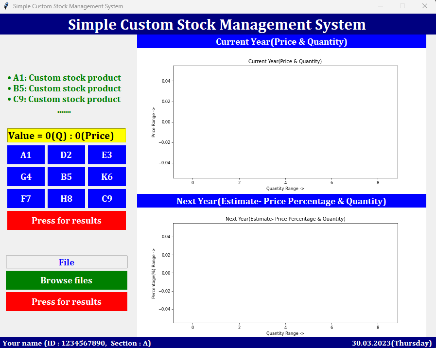
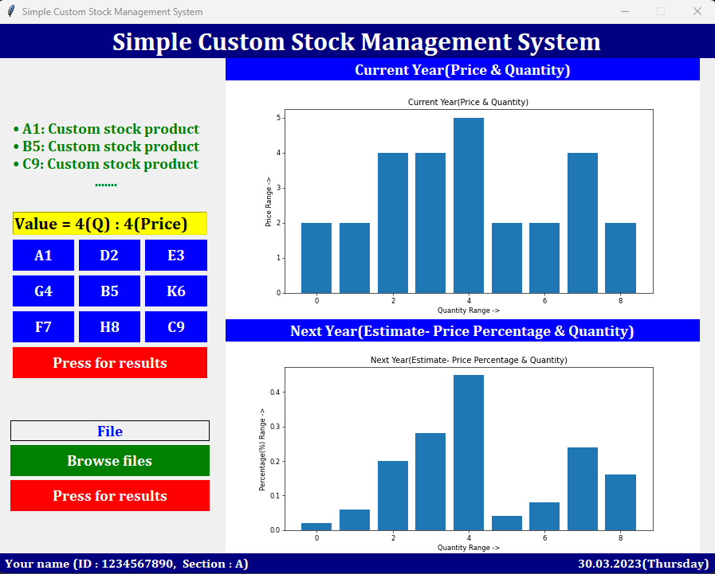
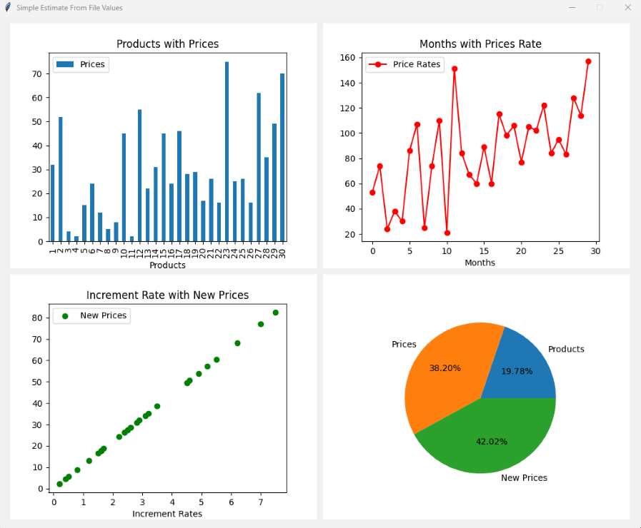

# Simple Product Sales Forecast

### **A Python-based _simple product sales forecast system_ using Tkinter GUI**

Tkinter is a Python binding to the Tk GUI toolkit. It is the standard Python interface to the Tk GUI toolkit, and is Python's defacto standard GUI.


## Task Description

A project to build a Python-based simple product sales forecast system. Here use some custom mathematics for calculate stock product price and show some results with charts (Bar chart, Line chart, Scatter chart, Pie chart).


## Task Requirments
this project is developed using all new os, software and tools.

* **Operating System :** Windows11, Kali Linux2025.2
* **Software :** Python3.13, Visual Studio Code
* **GUI Library :** Tkinter (`Default`) 


## Installation

First [Download](https://www.python.org/downloads/), install and configure [Python](https://www.python.org/doc/). Then use the package manager [pip](https://pip.pypa.io/en/stable/) to install on.

* Windows installation
* Kali linux installation
* Mac installation


## Notes
The `requirements.txt` file, lists of all the Python libraries that my "**_Simple product sales forecast system_**" depends on and installs those packages from the file:

```bash
pip install -r requirements.txt
# or
sudo pip install -r requirements.txt
```

## Usages

* **Custom input:**<br/>
**A1, D2, E3, G4, B5, K6, F7, H8, C9** are custom sales product. When click on custom sales product then you get prices under custom sales products. After collect the prices press **Press for results** button and show results as plot(bar chart).
* **From CSV file:** browse csv file from your computer with three columns values. After browse file press **Press for results** button and show results as plots (bar chart, line chart, scatter chart, pie chart).


## Sreenshots
Here are some screenshots of the `Product Sales Forecast` project:

**Main**<br/>
<br/>
**Custom Output**<br/>
<br/>
**Output From File**<br/>
<br/>


## Contributing

Contributions, suggestions, and feedback are always welcome!<br/>
To contribute:

1. Fork the repository
1. Create a new branch (`feature/new-feature`)
1. Commit your changes
1. Push and submit a Pull Request

💬 You can also open an issue if you’d like to discuss a feature or report a bug.


## For more or connect with me

<p align='center'>
  <a href="https://github.com/iamx-ariful-islam"></a>&nbsp;&nbsp;
  <a href="https://bd.linkedin.com/in/iamx-ariful-islam"></a>&nbsp;&nbsp;
  <a href="https://x.com/mx_ariful_islam"></a>&nbsp;&nbsp;
  <a href="https://www.facebook.com/iamx.ariful.islam/"></a>
</p>


## License

The [MIT](https://choosealicense.com/licenses/mit/) License (MIT)


## Thank You for Visiting!

> “Good design is about making things simple yet significant”  
> — *Md. Ariful Islam*